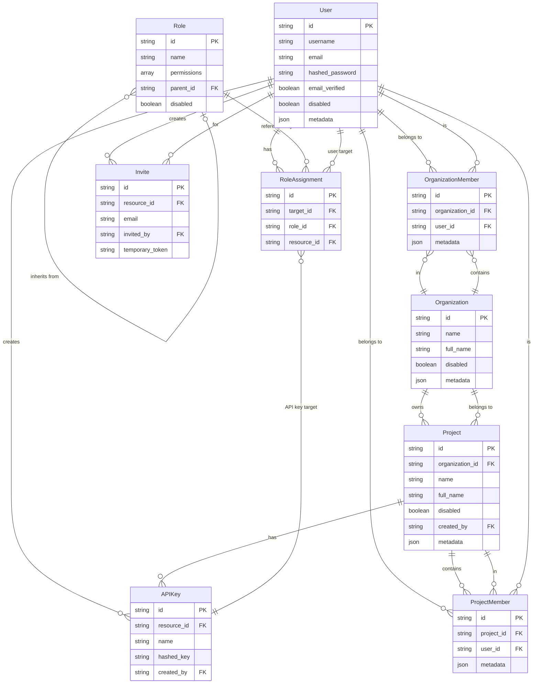

# Relationship Map

This diagram shows the relationships between the main entities in Any Auth.

## Key Entities

- **User**: The core identity entity representing a user with authentication credentials
- **Organization**: Top-level tenant grouping entity for multi-tenant applications
- **Project**: Container for resources that can belong to an organization
- **Role**: Collection of permissions defining access levels in the system
- **RoleAssignment**: Maps a target (User or APIKey) to a Role for a specific resource
- **OrganizationMember**: Associates a User with an Organization
- **ProjectMember**: Associates a User with a Project
- **APIKey**: Alternative authentication method for programmatic access
- **Invite**: Mechanism for inviting users to join organizations or projects

## Important Notes

- **Resource Context**: RoleAssignment.resource_id can refer to:
    - The platform itself (using the constant "platform")
    - An Organization.id
    - A Project.id

- **Role Hierarchy**: Roles support inheritance through parent_id, allowing for
  permission inheritance and role specialization

- **Multi-tenant Design**: The system supports multi-tenant architecture through
  the Organization → Project hierarchy

- **Flexible Authentication**: Both Users and API Keys can be assigned roles,
  enabling both human and programmatic access with proper authorization

- **Resource Ownership**: Projects can optionally belong to Organizations,
  supporting both standalone and organization-contextualized projects
