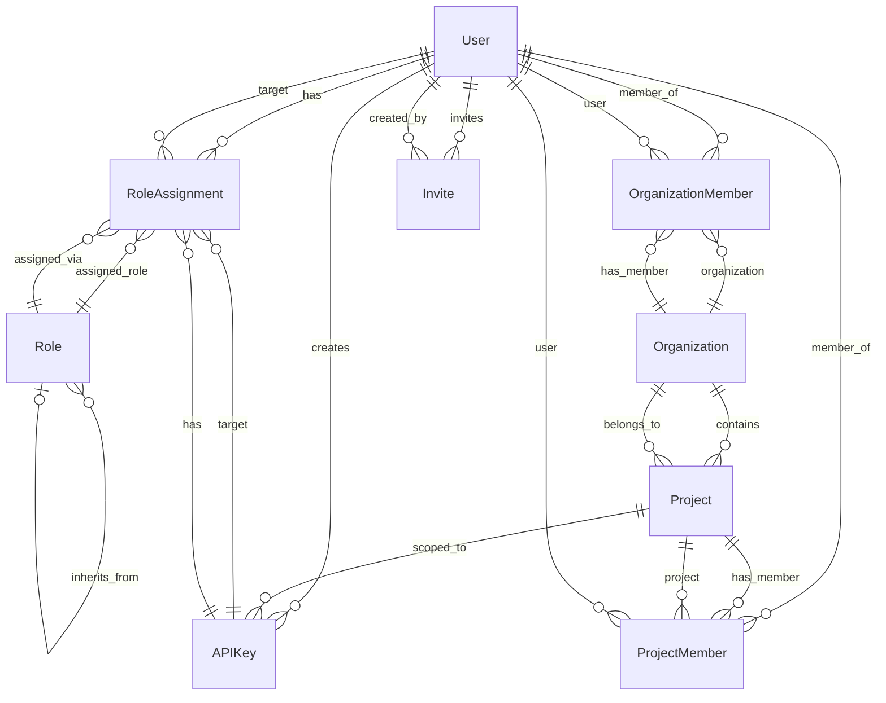

# Schema Relationship Map

This diagram illustrates the core relationships between the main data models in AnyAuth.

## Key Entities & Relationships

* **User**: The central identity[cite: 1056]. Can be a member of Organizations and Projects[cite: 1059, 1060], create API Keys[cite: 1066], send Invites[cite: 1073], and be assigned Roles[cite: 1064].
* **Organization**: A top-level grouping (tenant) containing Projects and OrganizationMembers[cite: 1057, 1059].
* **Project**: Belongs to an Organization (optional) [cite: 1058] and contains ProjectMembers [cite: 1060] and scoped API Keys[cite: 1066].
* **Role**: Defines permissions[cite: 1061]. Can inherit from parent Roles[cite: 1062]. Assigned to Users or API Keys via RoleAssignment[cite: 1064].
* **APIKey**: Used for programmatic access[cite: 1066]. Created by a User and scoped to a Project or Organization (indicated by RoleAssignment's `resource_id`)[cite: 1066, 1064]. Can be assigned Roles[cite: 1064].
* **RoleAssignment**: Links a User or APIKey (`target_id`) to a Role (`role_id`) for a specific resource (`resource_id`, which can be "platform", an Organization ID, or a Project ID)[cite: 1064].
* **OrganizationMember / ProjectMember**: Bridge tables connecting Users to Organizations/Projects[cite: 1059, 1060].
* **Invite**: Allows a User to invite someone (via email) to a resource [Organization or Project](cite: 1073).

*(**Note**: The original filename `relationshep_map.md` contains a typo. It should likely be `relationship_map.md`.)*
